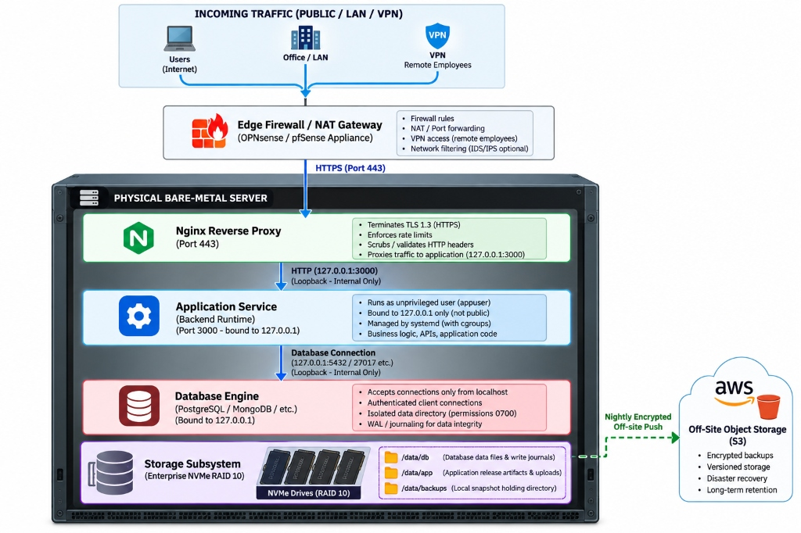
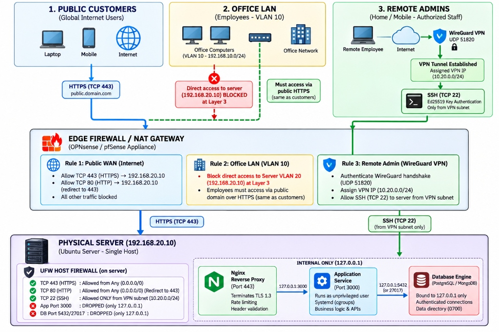
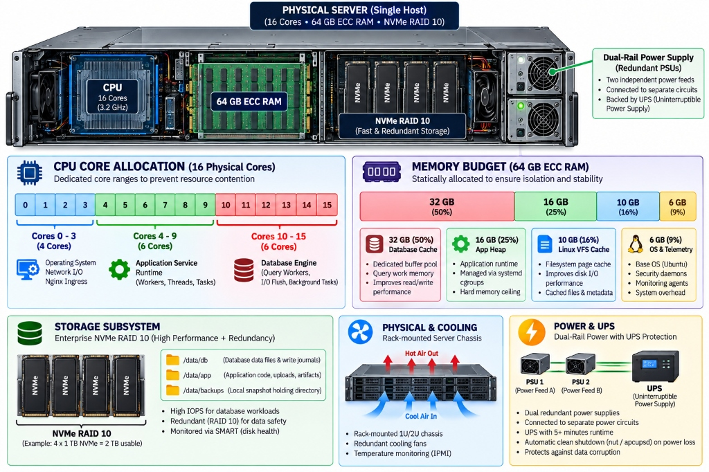
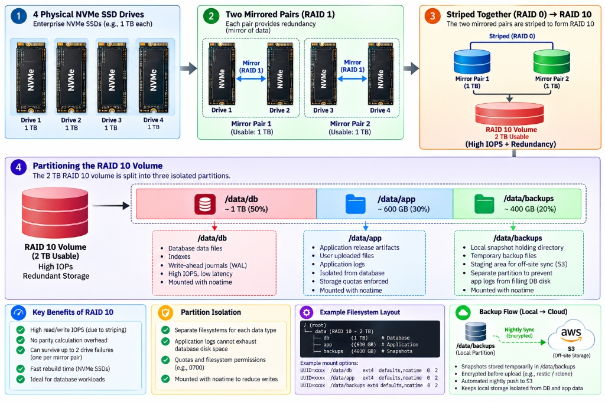
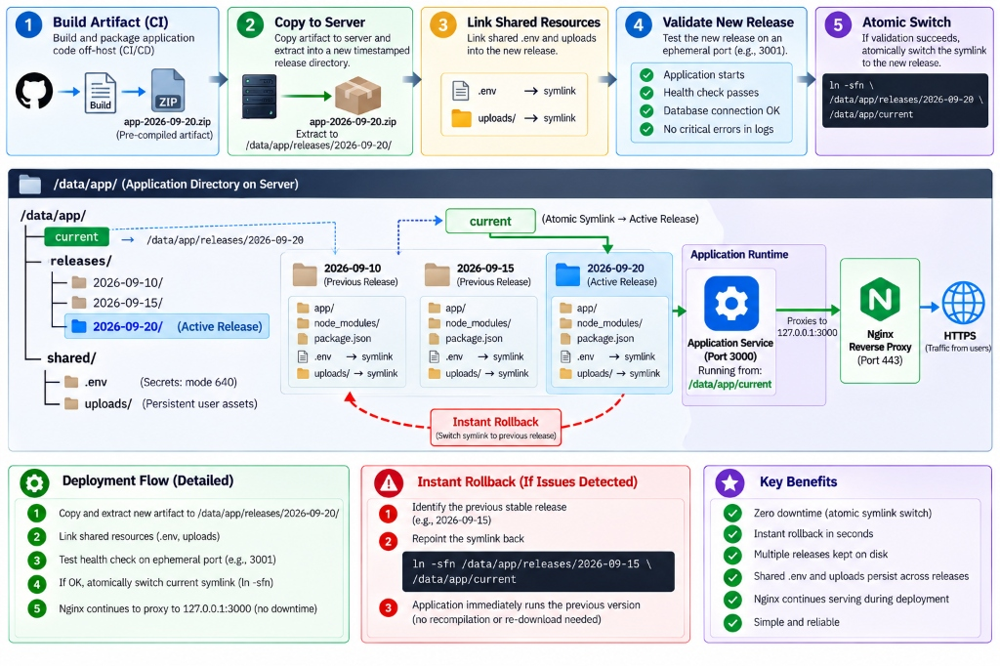

# Production Architecture: Single-Server Deployment

## 1. The Foundation & Tech Stack

This setup runs everything on one well-hardened bare-metal machine: the reverse proxy, your application, and the database all live side-by-side on a single physical host.

The guiding philosophy is simple — **bare-metal speed with kernel-level isolation**. Services talk to each other over the loopback adapter (`127.0.0.1`) at microsecond latencies, so there's no network hop overhead. Meanwhile, the Linux kernel, systemd, and UFW enforce strict security boundaries between those services. This design works with any programming language and any database engine.

### Recommended Tech Stack

| Layer | Technology | Version | What It Does |
|---|---|---|---|
| **Operating System** | Ubuntu Server LTS | **24.04 LTS (Noble Numbat)** | Linux Kernel 6.8+ with cgroups v2, AppArmor, eBPF telemetry, and long-term security patches. |
| **Server Hardware** | Enterprise 1U/2U Rack (Dell PowerEdge / HPE ProLiant) | **Latest Gen (AMD EPYC / Intel Xeon)** | 16+ cores, 64GB+ ECC RAM, dual hot-swap PSUs, IPMI/iDRAC out-of-band management on its own VLAN. |
| **Storage** | 4× Enterprise NVMe SSDs | **PCIe Gen 4/5 Enterprise** | RAID 10 (striped mirrors) for high random-write IOPS, no parity overhead, and tolerance for up to two drive failures. |
| **Power Continuity** | Smart On-Line UPS (USB/SNMP) | **NUT / apcupsd** | Battery backup with dual-rail feeds. Triggers a safe database flush and clean shutdown when power fails. |
| **Edge Firewall** | OPNsense / pfSense | **OPNsense 24.7 / pfSense Plus 24.03** | Perimeter NAT gateway, VLAN routing, stateful packet filtering, and WireGuard VPN endpoint. |
| **Reverse Proxy** | Nginx | **1.26 LTS** | High-concurrency TLS 1.3 termination, security headers, rate limiting, and request buffering. |
| **Host Firewall** | UFW / Netfilter (iptables) | **UFW 0.36+ / iptables 1.8.10+** | Default-deny on all inbound traffic. External access to internal ports is silently dropped. |
| **Admin Access** | WireGuard | **1.0.0+ (In-Kernel)** | Encrypted Noise-protocol tunnel (ChaCha20-Poly1305) with Ed25519 key auth — no public SSH port needed. |
| **Process Manager** | systemd | **v255+** | Manages service lifecycles, auto-restarts on crashes, enforces memory ceilings (`MemoryMax`), and sandboxes the filesystem. |
| **Observability** | Prometheus Node Exporter & Promtail | **Node Exporter 1.8+, Promtail 3.1+** | Ships metrics and log streams out-of-band to an external Grafana + Loki cluster. |
| **Backup Storage** | S3-Compatible Object Storage | **AWS S3 / Wasabi (WORM Mode)** | Off-site immutable backups with Object Lock in Compliance Mode — ransomware can't delete them. |

### The Four Rings of Isolation

Think of the security model as four concentric rings. Each ring adds another layer of protection:

```
┌──────────────────────────────────────────────────────────────────────────┐
│  RING 1: HARDWARE & STORAGE FAULT TOLERANCE                              │
│  • ECC RAM (Auto-corrects bit-flips; prevents silent database corruption)│
│  • NVMe RAID 10 (High IOPS + survives up to 2 physical drive failures)   │
│  • Dual Hot-Swap PSUs + Smart UPS (Automated transaction-safe shutdown)  │
├──────────────────────────────────────────────────────────────────────────┤
│  RING 2: NETWORK & PERIMETER ZERO-TRUST                                  │
│  • Edge Firewall: NAT forwards only TCP 443 & 80 to private server IP    │
│  • Corporate LAN (VLAN 10): Direct access to server VLAN 20 is BLOCKED   │
│  • Management Plane: SSH reachable ONLY via encrypted WireGuard VPN      │
├──────────────────────────────────────────────────────────────────────────┤
│  RING 3: OPERATING SYSTEM & KERNEL SANDBOXING                            │
│  • POSIX Separation: 'appuser' cannot read database files or /etc        │
│  • Systemd Cgroups: 'MemoryMax' caps app RAM; prevents DB starvation     │
│  • Filesystem Sandboxing: 'ProtectSystem=strict' & 'PrivateTmp=true'     │
├──────────────────────────────────────────────────────────────────────────┤
│  RING 4: SERVICE & DATA PIPELINE ISOLATION                               │
│  • Loopback Binding: DB and App listen strictly on 127.0.0.1             │
│  • Privilege Scoping: Application user holds DML-only permissions        │
│  • Backup Immutability: Off-site S3 Object Lock prevents deletion        │
└──────────────────────────────────────────────────────────────────────────┘
```

---

## 2. How Traffic Flows Through the System

The app and the database live on the same physical machine. They talk to each other entirely in memory — no network packets, no latency — over the loopback adapter (`127.0.0.1`) and local Unix sockets. This works regardless of which backend language or database you choose.



### End-to-End Request Journey

1. **Traffic arrives:**
   - **Public users** hit your domain on TCP 443 (HTTPS) from anywhere on the internet.
   - **Office staff** go through the same public HTTPS gateway — no special routing for them.
   - **Remote admins** connect through a WireGuard VPN tunnel on UDP 51820 before anything else.

2. **Edge firewall (OPNsense / pfSense):**
   - Enforces NAT and perimeter firewall rules.
   - Forwards *only* TCP 443 and 80 to the server's private IP (`192.168.20.10`).
   - Terminates WireGuard VPN connections for authorized admins.
   - Silently drops all port scans and unsolicited probes before they ever reach the server.

3. **Nginx reverse proxy (port 443):**
   - Terminates TLS 1.3 with modern ciphers.
   - Applies rate limiting and validates HTTP headers.
   - Passes clean requests downstream to the app on `127.0.0.1:3000`.

4. **Application service:**
   - Runs as an unprivileged `appuser` with no login shell.
   - systemd cgroups cap its memory (`MemoryMax`) and CPU, so a misbehaving app can't starve the database.
   - Talks to the database only over loopback (`127.0.0.1:<port>`).

5. **Database engine:**
   - Binds exclusively to `127.0.0.1` — it won't accept connections from the physical network.
   - Authenticates the app using salted cryptographic hashes.
   - Keeps all data files under `/data/db` with strict `0700` permissions.

6. **Storage & off-site backup:**
   - NVMe RAID 10 is split into `/data/db`, `/data/app`, and `/data/backups`.
   - Daily encrypted backups are pushed off-site to AWS S3 or Wasabi with Object Lock, so ransomware can't touch them.

---

## 3. Zero-Trust Access: Public Users, Office Staff & Remote Admins

Every connection is verified, no matter where it comes from. Being physically inside the office building gives you exactly zero extra access to the server.



### Who Can Access What

1. **Public customers (internet):**
   - Resolve your domain via DNS and connect over HTTPS (TCP 443).
   - Traffic flows through the edge gateway → Nginx → backend app. That's it.

2. **Office employees (VLAN 10 — `192.168.10.0/24`):**
   - All workstations, laptops, and Wi-Fi devices live on an isolated VLAN.
   - **Direct IP access from VLAN 10 to the production server (VLAN 20) is hard-blocked at the router.** No exceptions.
   - Office employees access the app the same way external customers do: via the public HTTPS domain.
   - Being in the office gives zero access to internal databases, SSH, or any management ports.

3. **Remote system administrators (WireGuard VPN):**
   - Admins establish an encrypted WireGuard tunnel on UDP 51820.
   - Authentication is done with pre-configured Ed25519 public keys — no passwords.
   - Once connected, the admin gets an internal VPN IP in the `10.20.0.0/24` range.
   - SSH (TCP 22) is only allowed from that VPN subnet. Root login is disabled; `sudo` is required and fully audited.

### Host Firewall Rules (UFW)

| Port / Protocol | Allowed From | Direction | Action | Why |
|---|---|---|---|---|
| **TCP 443 (HTTPS)** | Anywhere (`0.0.0.0/0`) | Inbound | **ACCEPT** | Public web traffic goes to Nginx. |
| **TCP 80 (HTTP)** | Anywhere (`0.0.0.0/0`) | Inbound | **ACCEPT** | Nginx catches this and 301-redirects to HTTPS. |
| **TCP 22 (SSH)** | VPN only (`10.20.0.0/24`) | Inbound | **ACCEPT** | Admin access only over WireGuard. |
| **App Port (3000)** | Loopback only (`127.0.0.1`) | Inbound | **DROP on NICs** | Only Nginx can reach it — invisible to the outside world. |
| **DB Port (5432/27017)** | Loopback only (`127.0.0.1`) | Inbound | **DROP on NICs** | Only the app can reach the database. |
| **Everything else** | Anywhere | Inbound | **DEFAULT DROP** | Silent drop — port scanners get no feedback. |

---

## 4. Nginx: The Public-Facing Shield

Nginx is the only process on this server that ever touches raw internet traffic. Everything else hides safely behind it:

```
[ Inbound Request ] ──► [ Nginx 1.26 LTS ] ──► [ Localhost Proxy ] ──► [ Application Service ]
                              │
                      • TLS 1.3 Termination
                      • HSTS, CSP, X-Frame-Options
                      • Leaky-Bucket Rate Limiting
                      • Client Request Buffering
```

- **TLS offloading:** Nginx handles the TLS 1.3 handshake using hardware-accelerated elliptic-curve cryptography, so your application workers don't burn CPU on crypto.
- **Security headers:** Every response gets `Strict-Transport-Security`, `X-Content-Type-Options: nosniff`, `X-Frame-Options: DENY`, and `Content-Security-Policy` injected automatically — mitigating XSS, clickjacking, and MIME-sniffing attacks.
- **Rate limiting:**
  - *Auth endpoints* — max 5 requests/minute per IP to stop credential-stuffing and brute-force attacks.
  - *General API routes* — max 30 requests/second per IP to prevent scraping and denial-of-service.
- **Slowloris protection:** Nginx buffers slow client uploads completely before handing them to the backend, so a slow connection can't exhaust your app's thread pool.

---

## 5. Hardware Sizing & Resource Allocation

Since the app and database share the same CPU, RAM, and storage bus, resources are carved up statically so neither service can starve the other:



### How the Resources Are Divided

1. **CPU (16 Physical Cores):**
   - **Cores 0–3 (4 cores):** Kernel, network interrupt handling, system daemons, and Nginx.
   - **Cores 4–9 (6 cores):** Application service — business logic, worker threads, garbage collection.
   - **Cores 10–15 (6 cores):** Database engine — query planning, background writes, transaction commits.

2. **RAM (64 GB ECC):**
   - **32 GB (50%):** Database shared buffers, index caching, and query working memory.
   - **16 GB (25%):** Application heap, hard-capped via systemd cgroups (`MemoryMax=16G`).
   - **10 GB (16%):** Linux VFS page cache to speed up repeated file and database reads.
   - **6 GB (9%):** OS kernel, telemetry agents, and security tools.

3. **Storage:**
   - Four enterprise NVMe SSDs in RAID 10 — high IOPS, two-drive failure tolerance, monitored via SMART.

4. **Chassis & Cooling:**
   - 1U/2U rack-mount with front-to-back airflow, redundant cooling fans, and IPMI hardware monitoring.

5. **Power Resilience:**
   - Dual hot-swap PSUs on independent power circuits (Feed A and Feed B).
   - Backed by an intelligent on-line UPS providing 5+ minutes of battery runtime.
   - `nut` / `apcupsd` monitors the UPS and triggers an automatic safe shutdown if power doesn't recover in time.

---

## 6. Storage Layout & Partition Isolation

The four NVMe SSDs are configured in **RAID 10** — you get the write speed of striping and the redundancy of mirroring at the same time:



### How It's Built

1. **Four identical enterprise PCIe NVMe SSDs** (e.g., 1 TB each).
2. **Mirror pairs:** Drives 1+2 form Mirror Pair 1; Drives 3+4 form Mirror Pair 2. Each pair is a complete mirror.
3. **Stripe:** The two mirror pairs are striped together into one unified ~2 TB volume — zero parity penalty, full redundancy.
4. **Partitions:**
   - `/data/db` (~1 TB / 50%) — database tables, indexes, and WAL journals. Mounted with `noatime`, permissions `chmod 0700`.
   - `/data/app` (~600 GB / 30%) — application releases, user uploads, and logs. Quotas prevent logs from eating database disk space.
   - `/data/backups` (~400 GB / 20%) — staging area for encrypted daily snapshots before they're pushed off-site.
5. **Performance tuning:** All data partitions are mounted with `noatime`, eliminating unnecessary write overhead on every file read.

---

## 7. OS Hardening & Process Sandboxing

The production server runs a lean OS — no compilers (`gcc`, `make`), no build tools, no unnecessary daemons. If it doesn't need to be there, it isn't.

```
┌──────────────────────────────────────────────────────────────┐
│                    SECURITY SANDBOX                          │
│                                                              │
│  [ Application Sandbox ]                                     │
│  • Runs as unprivileged 'appuser' (shell: /sbin/nologin)     │
│  • MemoryMax = 16GB (Hard cgroup ceiling via systemd)        │
│  • ProtectSystem = strict (OS filesystems mounted read-only) │
│  • PrivateTmp = true (Isolated temporary filesystem)         │
│  • Permissions: Zero read access to database data directory  │
│                                                              │
│  [ Database Sandbox ]                                        │
│  • Runs as dedicated database system user                    │
│  • Listens strictly on 127.0.0.1                             │
│  • Data directory permissions restricted to mode 0700        │
└──────────────────────────────────────────────────────────────┘
```

- **systemd sandboxing:** The app runs as `appuser` with no shell access. systemd enforces `MemoryMax=16G` (a memory leak won't crash the host), `ProtectSystem=strict` (system binaries are mounted read-only), and `PrivateTmp=true` (gives the service its own isolated `/tmp`).
- **Kernel hardening (sysctl):** Enables strict reverse-path filtering (`rp_filter=1`) to block IP spoofing, activates SYN cookies (`tcp_syncookies=1`) to absorb SYN floods, and disables ICMP redirects.
- **Audit trail (`auditd`):** Hooks into kernel syscalls to keep an immutable log of any changes to sensitive files like `/etc/shadow`, `/etc/ssh/sshd_config`, and application secrets.

---

## 8. Deployments & Zero-Downtime Releases

Releases use an **Atomic Symlink Strategy**. Artifacts are built off-server in CI — no compilers, npm, or pip ever run in production.



### The Five-Step Deployment Flow

1. **Build in CI:** Code is compiled, tested, and packaged into a production artifact (zip/tarball) on an external CI runner. The production server stays clean.
2. **Copy & extract:** The artifact is copied to the server and unpacked into a new timestamped directory under `/data/app/releases/<timestamp>/`.
3. **Link shared resources:** Secrets (`.env` in `/data/app/shared/`, mode `640`) and persistent user uploads are symlinked into the new release folder.
4. **Health check:** The app is started on a temporary local port (e.g., 3001) and checked for database connectivity and dependency health before any live traffic hits it.
5. **Atomic switch:** If the health check passes, the `current` symlink is atomically pointed at the new release with `ln -sfn`. Nginx keeps serving traffic with zero downtime.

### Instant Rollback

If something goes wrong after a deploy, repoint the `current` symlink back to the previous release directory. The app is back on the known-good version in seconds — no re-downloading, no rebuilding.

---

## 9. How the App and Database Talk to Each Other

These two services communicate entirely inside the machine:

```
[ Nginx Reverse Proxy ]
          │
          ▼ (Unix Domain Socket / Localhost HTTP — sub-10 microsecond latency)
[ Application Service ]
          │
          ▼ (Loopback TCP: 127.0.0.1 — sub-millisecond query execution)
[ Database Engine ]
```

- **Loopback-only binding:** The database only listens on `127.0.0.1`. Any connection attempt from the physical network is rejected at the socket layer.
- **Least-privilege database user:** The app connects with a non-admin database account. Credentials live in an out-of-tree `.env` file (mode `640`). The account can read and write data (DML), but it cannot drop tables or alter the system (`DROP TABLE`, `ALTER SYSTEM` are off-limits).

---

## 10. Observability & Monitoring

Telemetry collection is out-of-band — lightweight local agents gather data and ship it to a separate external monitoring cluster, so observability doesn't interfere with the production workload:

```
[ Production Server ]
  • Node Exporter   ──(Metrics scrape over VPN)──►  [ Central Prometheus & Grafana ]
  • Promtail        ──(TLS log streaming)────────►  [ Central Grafana Loki ]
```

- **Proactive alerting:** On-call engineers get notified via Slack or PagerDuty when disk hits 80%, RAM hits 85%, or HTTP 5xx error rates exceed 1%.
- **Immutable log storage:** Promtail streams logs in real time to external WORM storage. Even if the host is fully compromised, the audit records stay intact.

---

## 11. Backup Strategy & Disaster Recovery

Data durability follows the **3-2-1 rule** — three copies, two media types, one off-site:

```
[ 1. Live Data ]             Database files on NVMe RAID 10
      │
      ▼ (Continuous Write Log Streaming)
[ 2. Local Backup ]          Encrypted staging in /data/backups (15-min recovery target)
      │
      ▼ (Encrypted TLS Push)
[ 3. Off-Site Storage ]      AWS S3 / Wasabi with Object Lock (WORM Immutability)
```

- **RPO (Recovery Point Objective): < 5 minutes** — continuous transaction log streaming keeps data loss minimal.
- **RTO (Recovery Time Objective): < 4 hours** — full bare-metal or virtual standby provisioning, snapshot rehydration, and DNS cutover.
- **Ransomware immunity:** Off-site storage uses Object Lock in Compliance Mode. Backup archives cannot be deleted or overwritten — not even by host admin credentials.

---

## 12. Known Limitations & How to Handle Them

Every architecture has trade-offs. Here's what to watch for with this design:

| Limitation | Impact | Mitigation |
|---|---|---|
| **Single Point of Failure (SPOF)** | A motherboard or CPU failure takes everything down until hardware is replaced. | Keep a standby host receiving continuous DB transaction log replication. Repoint DNS (TTL 300s) to the standby within 15–30 minutes during a major failure. |
| **Vertical Scaling Ceiling** | You can only add so much RAM and CPU to one machine. | Add a secondary read replica for read-heavy workloads, or move the database to its own dedicated server as you grow. |
| **Shared Resource Contention** | Heavy database batch jobs can compete with the app for CPU and I/O. | systemd cgroup limits (`CPUQuota`, `MemoryMax`) on the app, database query timeouts (`statement_timeout=30s`), and route analytics queries off-host. |
| **Blast Radius on Compromise** | A root compromise could expose both app files and the local database. | Unprivileged execution, strict file permissions (`0700` for DB, `640` for secrets), application-layer encryption of sensitive fields, and off-site isolated backups. |
| **Reboot Downtime for Kernel Patches** | Kernel security updates require a reboot. | Use Linux live-patching (`kpatch` / Canonical Livepatch) for in-memory kernel updates. Schedule mandatory reboots during low-traffic windows. |
| **DDoS Vulnerability** | A volumetric packet flood can saturate the edge link before your firewall can do anything. | Put an Anycast CDN (like Cloudflare) in front of your domain to absorb volumetric attacks before they reach your router. |

---

## 13. What This Architecture Guarantees

- **Sub-millisecond inter-tier latency** — the app and database talk in memory, not over a network.
- **Language and database agnostic** — swap out the runtime or database engine without changing the architecture.
- **Zero-trust access control** — internet, office LAN, and admin VPN are strictly separated with no implicit trust.
- **Hardware fault tolerance** — RAID 10 storage redundancy and dual-rail UPS battery protection.
- **Predictable recovery** — continuous transaction log archiving with < 5 min RPO and < 4 hr RTO.
